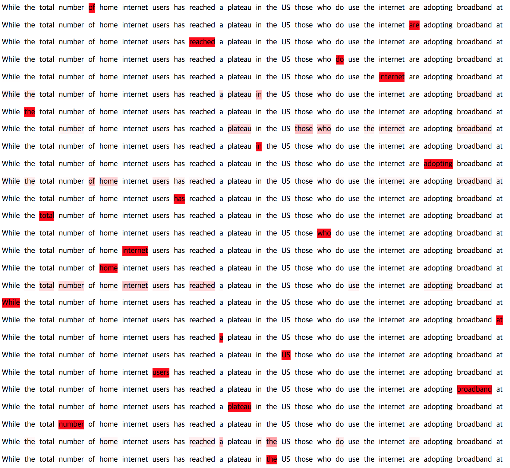
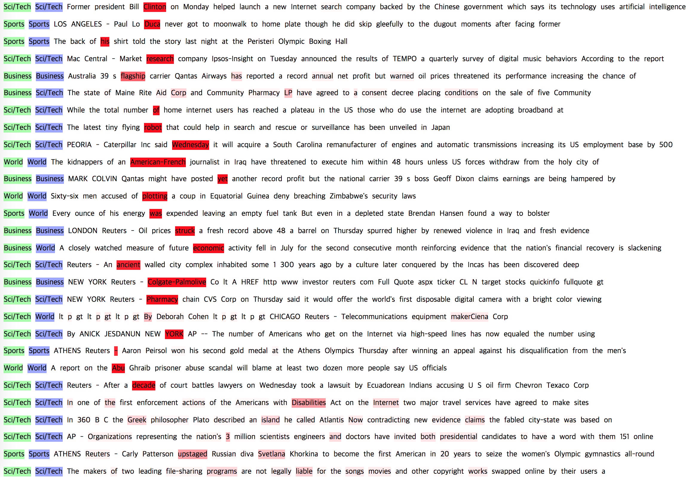

# Self-Attentive
Implementation of ["A Structured Self-Attentive Sentence Embedding"](https://arxiv.org/abs/1703.03130)

## Result
Accuracy: 0.85

## Visualization
#### Multi annotation vector - multi *r* hops 
 

#### Single annotation vector - single *r* hop 
 

## Reference
<https://arxiv.org/abs/1703.03130> 
<https://github.com/flrngel/Self-Attentive-tensorflow>

